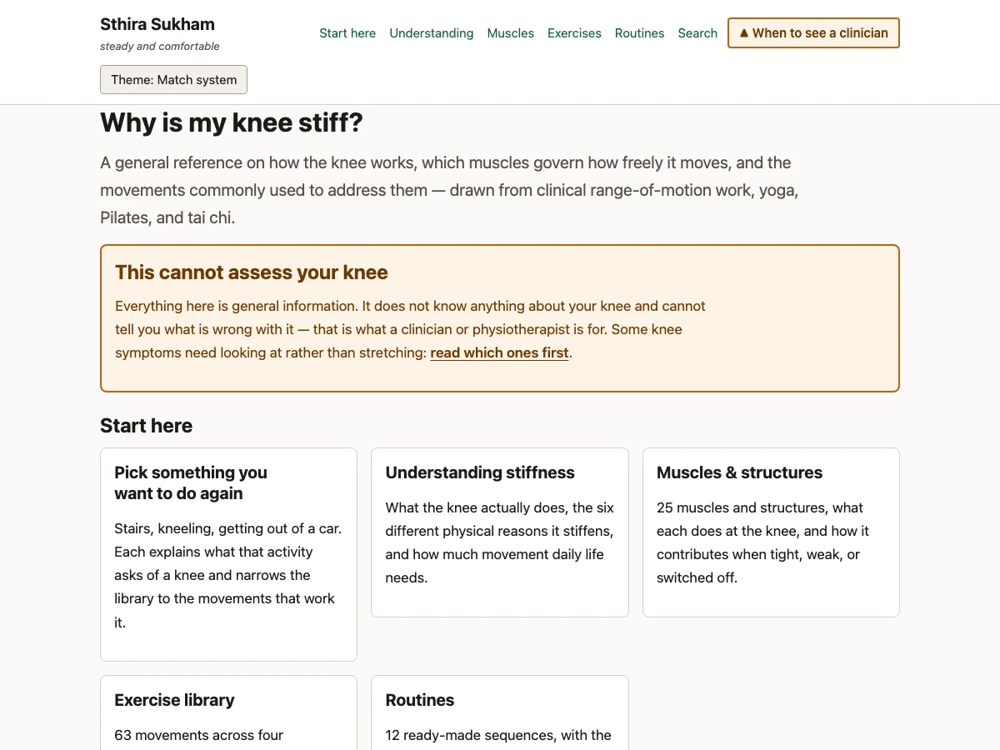
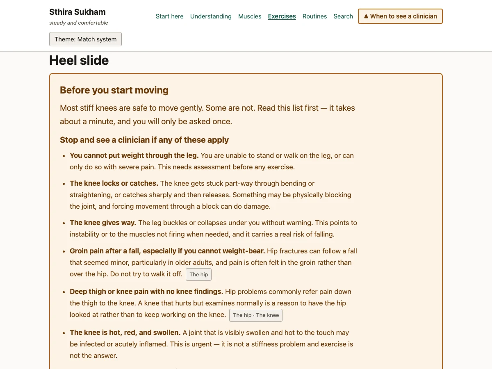
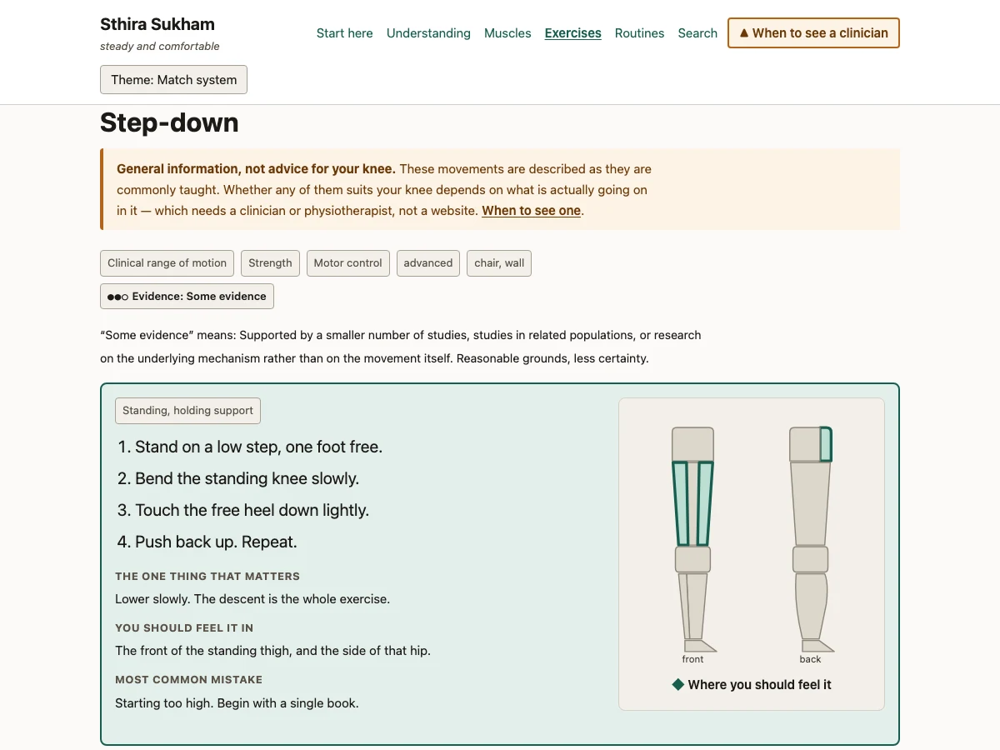
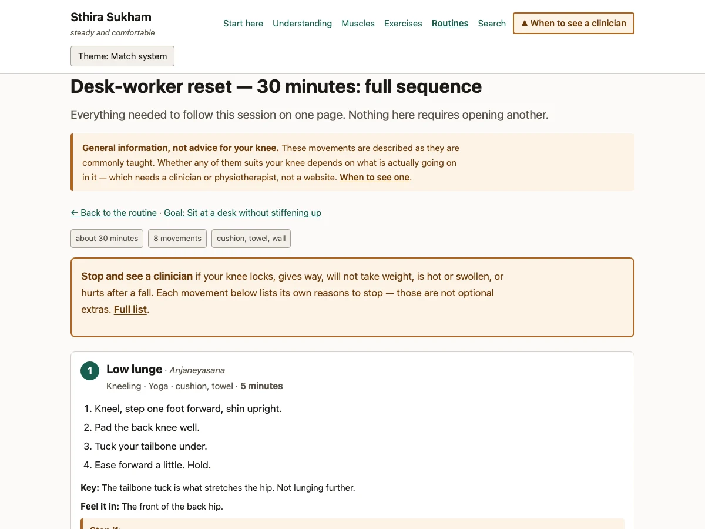
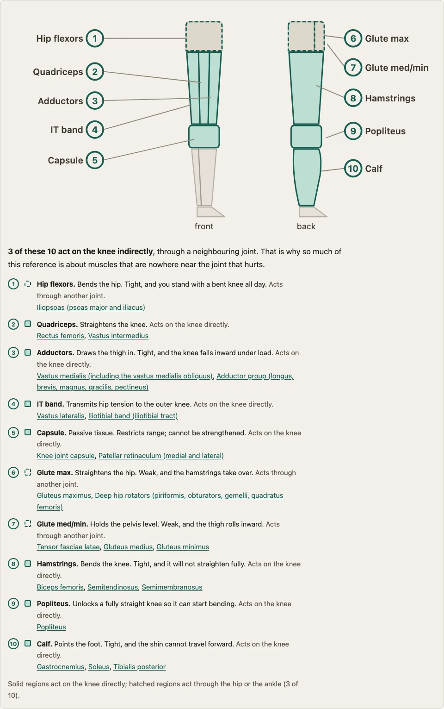
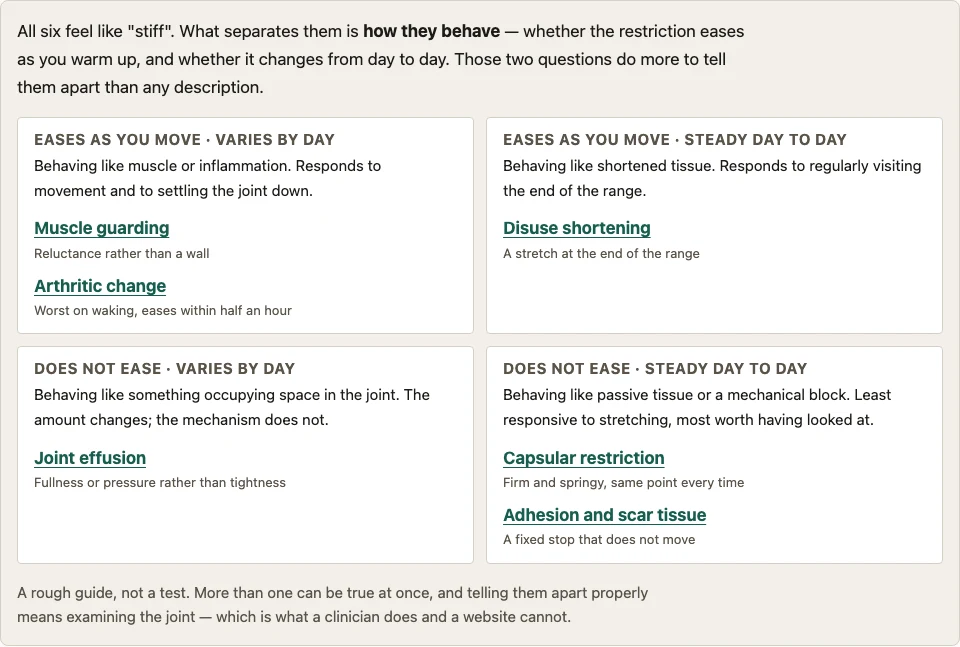
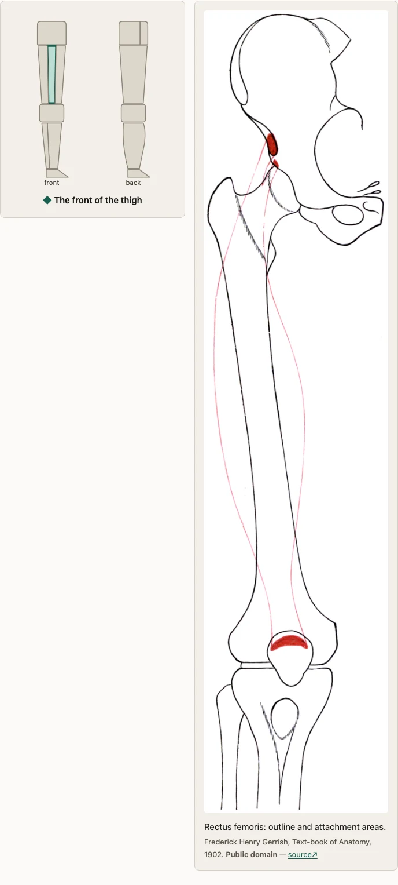
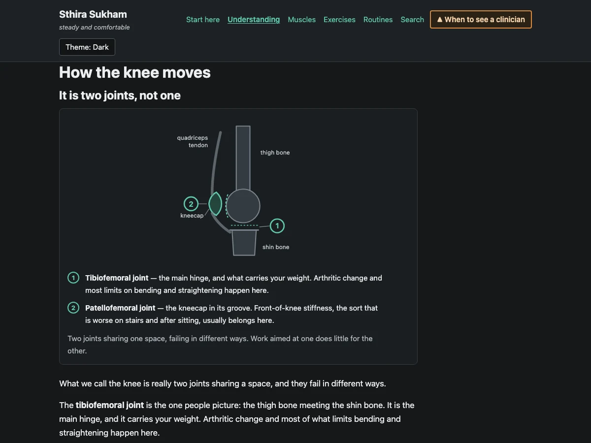
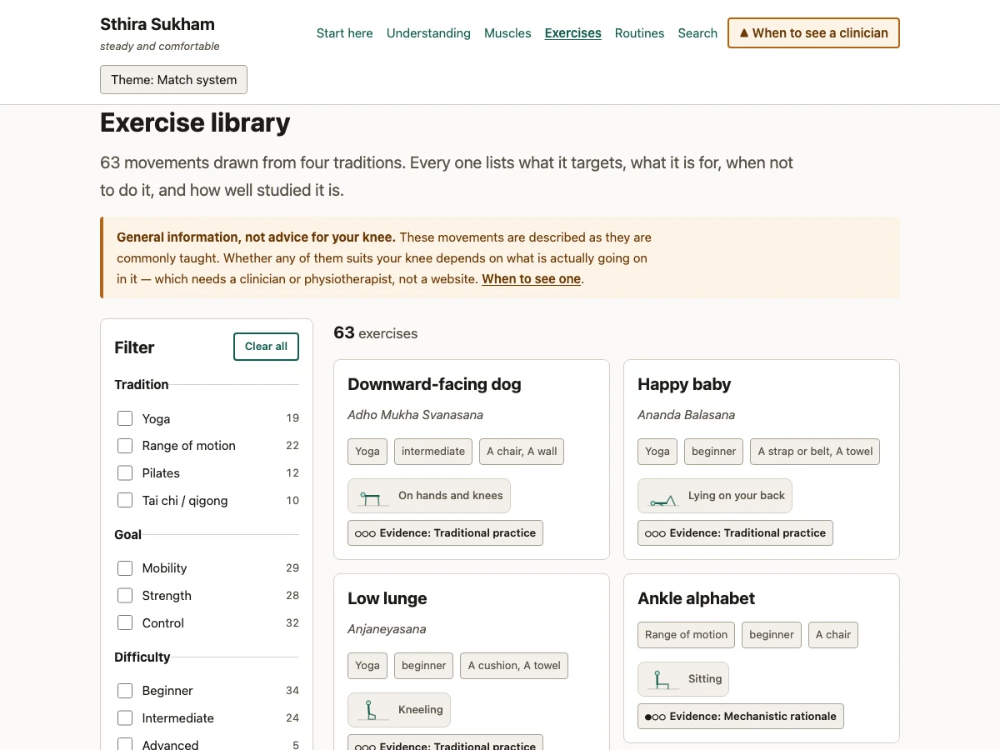

# Sthira Sukham

[](https://github.com/SreeGD/sthira-sukham/actions/workflows/verify.yml)


<sub>The verify badge runs the full `pnpm verify` gate — build, content policy, network
isolation, unit and e2e. While this repository is private, GitHub only renders that badge for
viewers who have access; elsewhere it will show as a broken image. The runtime badge states a
property that `pnpm check:isolation` enforces on every build, so it cannot quietly stop being
true.</sub>

> *sthira sukham āsanam* — "the posture should be steady and comfortable." Yoga Sūtra 2.46

A locally-run, static educational reference on stiff joints — knee, hip and ankle as a connected
chain: how each joint works, the muscles and structures that govern how freely it moves, and the
movements commonly used to address them, drawn from clinical range-of-motion work, yoga, Pilates,
and tai chi.

The organising idea is that a stiff joint is frequently another joint's problem. Every structure
declares which joints it influences and whether it acts on them **directly** or **through a
neighbouring joint**, so that relationship is validated data you can follow in both directions —
not prose that happens to mention it.

It runs entirely on your machine. No server, no accounts, no tracking, no network requests.

**It is not medical advice.** It cannot assess your knee and does not try to. It has no symptom
checker and no personalised programme, deliberately — see [the constitution](.specify/memory/constitution.md),
Principle I.

## What it looks like

| | |
|---|---|
|  |  |
| **Home.** Four sections, and framing that says up front the reference cannot assess your knee. | **The gate.** Deep-link to any exercise on a first visit and this comes first. It is server-rendered and visible by default — with JavaScript disabled it stays up. |
|  |  |
| **An exercise.** Short steps in large type, the one thing that matters, where you should feel it, and the common mistake — with a diagram derived from the exercise's own target muscles. | **The sheet.** A whole routine on one page: every movement's steps and stop-criteria inline, so nothing needs clicking mid-session. |
|  |  |
| **What acts on a joint.** Generated per joint from the content: solid regions act directly, hatched ones act through a neighbouring joint. | **Why it stiffens.** The six mechanisms sorted by *behaviour* — all six feel like "stiff", so what separates them is whether they ease with movement and vary by day. |
|  |  |
| **A structure.** Where it sits, plus a public-domain plate with its licence and source shown, not merely stored. | **Both themes.** Light and dark are fully supported, and every diagram is drawn from theme tokens rather than a second asset. |



**The library.** 63 movements across four traditions, filterable by tradition, goal, difficulty, equipment and target structure. With JavaScript disabled it renders the complete list unfiltered — degraded, never broken.

## Running it

```bash
pnpm install
pnpm dev        # http://localhost:4321
pnpm build      # static output → dist/
```

Requires Node 22+ and pnpm 10+.

## The gates

```bash
pnpm verify     # build + validate + check:isolation + test + test:e2e
```

That single command is what "does this still hold together" means here. It runs:

| Command | Checks |
|---|---|
| `pnpm build` | Every content record matches its schema. Missing field → build fails. |
| `pnpm validate` | Cross-record policy: references resolve, sources exist, safety fields present, modality balance |
| `pnpm check:isolation` | No external origins in fetching positions anywhere in `dist/` |
| `pnpm test` | Filtering, search, cross-link logic (Vitest) |
| `pnpm test:e2e` | Gate behaviour, filters, keyboard, accessibility in both themes (Playwright + axe) |
| `pnpm smoke:dev` | Every route renders on a running dev server (see below) |

## Adding content

All content lives in `src/content/`. Adding a muscle or an exercise means adding one Markdown file
— no code changes anywhere. That property is tested; if you find yourself editing a component to
make new content appear, something has regressed.

The authoring contract is
[`specs/001-knee-stiffness-reference/contracts/content-schemas.md`](specs/001-knee-stiffness-reference/contracts/content-schemas.md),
with worked examples. The short version:

```
src/content/
├── muscles/              one .md per muscle or structure
├── exercises/            one .md per movement
├── routines/             one .md per curated sequence
├── stiffness-sources/    six, fixed
├── stiffness-patterns/   four, fixed
└── data/
    ├── sources/*.yaml    citations, split by domain
    ├── evidence-labels.yaml
    └── red-flags.yaml
```

**The build will reject content that is incomplete.** An exercise without `contraindications`,
`stopIf`, or an `evidenceLabel` fails the build. A record without a source fails the build. A
reference to a nonexistent muscle fails `pnpm validate`. This is intended: there is no override
flag, and adding one would defeat the point.

Anatomical plates are public-domain scans stored as WebP (the set is 1.8MB; as PNG it was
8MB, with no visible difference at display size). A policy gate rejects PNG illustrations —
convert new ones with `cwebp -q 90 in.png -o out.webp`.

Every citation must be one you have actually opened. `title`, `authorOrBody`, `year`, and a
locator (`url`, `doi`, or `isbn`) are all required, because a citation nobody can find is
indistinguishable from an invented one.

## Diagrams

Three, all originally authored inline SVG in `src/components/diagrams/`:

| Diagram | Where | What it shows |
|---|---|---|
| `KneeJoints` | `/understanding/mechanics/` | The tibiofemoral hinge and the patellofemoral joint as separate things |
| `RangeOfMotionArc` | `/understanding/mechanics/` | Flexion range with the thresholds daily activities need |
| `LegLocator` | every `/muscles/[id]/` | Front and back views with the structure's zone highlighted |
| `PositionFigure` | every `/exercises/[id]/` and every card | The starting position — lying, kneeling, standing, and so on |

Three constraints shaped them, and they are worth knowing before editing:

- **No external assets.** Inline SVG only — the isolation gate fails on any fetched
  origin, and stock medical imagery is barred by the constitution's content standards.
- **Nothing is carried by the picture alone.** Every diagram has a text equivalent:
  numbered markers explained in an HTML caption, bands listed with their degree ranges,
  the highlighted zone named in words. Colour is always paired with shape, dash pattern,
  or text (SC-011). `tests/e2e/diagrams.spec.ts` asserts the equivalence.
- **Explanatory text lives in HTML, not SVG.** SVG text does not wrap, does not scale
  with the reader's font size, and clips silently when it outgrows the viewBox — which it
  did in the first draft. There is a test that catches that specific failure by comparing
  every text node's bounding box against its viewBox.

Both `LegLocator` and `PositionFigure` are **one drawing serving every record**: the zone
or position comes from a content field (`diagramZone`, `startPosition`), so adding a muscle
or an exercise needs no new artwork. `PositionFigure`'s geometry lives in
`src/lib/positions.ts` because the Astro component and the Preact filter island both render
it, and duplicated paths would let the two views drift.

**Why not photographs or licensed illustrations?** For anatomy they would be possible —
openly-licensed sources exist. For exercises they effectively do not: there is no
permissively-licensed image set covering these specific 44 movements, and images found by
search are almost always copyrighted regardless of where they appear. The constitution
requires illustration to be originally authored or carry a recorded redistribution licence,
and Principle V requires it bundled rather than fetched.

## How it is built

Astro 7 (static) with content collections, three Preact islands, hand-written CSS. TypeScript
throughout. See [`plan.md`](specs/001-knee-stiffness-reference/plan.md) for the reasoning and
[`research.md`](specs/001-knee-stiffness-reference/research.md) for the decisions and what was
rejected.

Two things are worth knowing before changing anything:

**The red-flag gate fails safe.** It is server-rendered and *visible by default*; a pre-paint
script reveals the exercise content by stamping `<html data-ack>`. With JavaScript disabled the
gate stays up. Inverting this — hiding the gate by default and showing it with JS — would pass most
tests and be a Principle I violation in production. `tests/e2e/red-flag-gate.spec.ts` has a
JS-disabled test specifically to catch it.

**The dev server is stricter than the build in places.** A duplicated JSX attribute once
built and tested clean while throwing a TypeError in `pnpm dev` — and dev is what people
actually use. `pnpm smoke:dev` requests every route from a running dev server and fails on
Astro's error overlay. It is not part of `pnpm verify` because it needs a server already
running; run it after `pnpm dev` when you have changed components.

**Referential integrity is not free.** Astro's `reference()` validates id shape, not existence —
a dangling reference builds clean. `scripts/validate-content.ts` is what actually enforces it, and
it is a required step in `pnpm verify`.

## Project docs

- [Constitution](.specify/memory/constitution.md) — the six principles governing this project
- [Specification](specs/001-knee-stiffness-reference/spec.md) — user stories, requirements, success criteria
- [Plan](specs/001-knee-stiffness-reference/plan.md) · [Research](specs/001-knee-stiffness-reference/research.md) · [Data model](specs/001-knee-stiffness-reference/data-model.md)
- [Quickstart & validation guide](specs/001-knee-stiffness-reference/quickstart.md) — including the manual checks automation cannot cover
- [Tasks](specs/001-knee-stiffness-reference/tasks.md)

## Status

The application is complete and all gates pass. The content library is **seeded rather than
exhaustive**: 3 joints, 25 muscles and structures, **63 exercises**
across all four modalities (clinical 13, yoga 11, Pilates 10, tai chi 10), 3 routines, 6 stiffness
sources, 4 patterns, 8 red flags.

That is inside the spec's 40–60 target. Further expansion is content work, not code work. The
constraint remains sourcing: every record needs citations that have actually been checked, and the
build refuses records that lack them.
